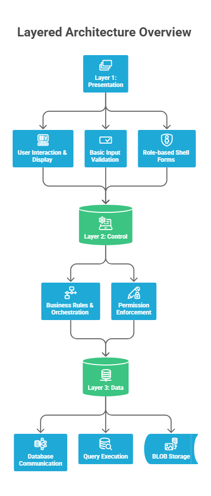
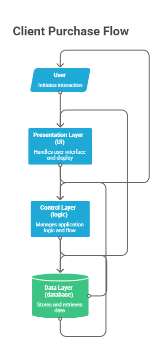

# 🏬 Retail Management System


---

## 📝 Overview

**Retail Management System** is a Windows Forms desktop application built as an academic project, simulating the day-to-day operations of a real retail store.

The goal was to go beyond a simple CRUD exercise and build something that actually reflects how a retail business works: with inventory, employees, clients, sales, and a permission system that varies depending on who is logged in. The four user roles (Admin, Manager, Employee, and Client) each have a different experience of the system, which required thinking carefully about architecture from the start rather than bolting permissions on at the end.

> 🗒️ Code comments and the database documentation in `baseDadosLoja.txt` are written in Portuguese, as this was developed for academic purposes in Portugal.

---

## 🎞️ Demo

https://github.com/goncalo-f-oliveira/retail-management-system/assets/demo.mp4

### GIFs Keys Flow

**<h3>1️⃣ Login, Validation & Client Purchase Flow</h3>**

<p align="left">

  

</p>

<i>Shows login and registration with validation, followed by a client browsing products, using filters, adding items to the cart, and completing a purchase.</i>

<br>

**<h3>2️⃣ Product CRUD (Admin Operations)</h3>**

<p align="left">

  

</p>

<i>Demonstrates the admin registering a new product, consulting the list, updating details, deleting items, and testing validation rules.</i>

<br>

**<h3>3️⃣ Admin Permissions Overview</h3>**

<p align="left">

  

</p>

<i>Displays all admin privileges, including access to registration and consultation modules, employee and product updates, search functionality, and general CRUD interactions.</i>

---

## 🏗️ Architecture & Design Decisions

The system is built around a **3-layer architecture**: Presentation, Control, and Data, and that structure was intentional from day one, not something that emerged organically.

<picture>
  <source media="(prefers-color-scheme: dark)" srcset="./assets/arquitechture-light.png">
  
</picture>

| Layer | What it does |
|---|---|
| **Presentation** | All Windows Forms: every `frm*` form, user input, and what gets displayed |
| **Control** | Business logic, permission enforcement, and validations |
| **Data** | SQL Server connection, query execution, and BLOB image handling |

The main reason for this separation was the permission system. With four roles that each have different access rights, it would have been tempting to scatter `if (role == Admin)` checks across the form event handlers. Instead, all permission logic lives in the Control layer, which keeps the UI clean and makes it much easier to reason about what each role can actually do.

The Presentation layer itself is also structured deliberately: split into `REGISTER/`, `CONSULT/`, and `UPDATE/` folders that map directly to Create, Read, and Update operations. This means anyone reading the project can navigate it without needing to understand the business logic first.

One smaller but deliberate choice was storing product images as BLOBs in SQL Server rather than as file paths pointing to an external folder. It makes the system self-contained: the database backup includes everything, and there is no risk of the image paths breaking when the project is moved between machines.

---

## 👤 User Roles & Permissions

The permission matrix was designed upfront. Each role has a dedicated shell form (`frmAdmin`, `frmManager`, `frmEmployee`, `frmClient`) that only exposes the modules that role is allowed to use, rather than showing everything and hiding parts based on conditions.

<picture>
  <source media="(prefers-color-scheme: dark)" srcset="./assets/client-flow-light.png">
  
</picture>

| Role | Register | Consult | Update | Delete |
|---|---|---|---|---|
| **Admin** | Clients, Employees, Products, Sales | All tables | All entities | ✅ |
| **Manager** | Clients, Products, Sales | All except Employees | All except Employees | ✅ |
| **Employee** | Clients, Sales | Clients, Sales, Stock | Clients, Sales | ❌ |
| **Client** | — | Products, Cart | — | — |

---

## 👨‍💻 My Contributions

This was a group academic project. My role covered the parts I found most interesting architecturally.

I defined and enforced the 3-layer structure across the team, built the permission logic and the role-based shell forms, and implemented the majority of the Windows Forms interface across all three CRUD folders. I also wrote the business validations and error handling in the Control layer, set up all the database scripts, and put together this documentation and repository organisation.

---

## 💻 Technologies

**C# / .NET Framework 4.7.2** · **Windows Forms** · **SQL Server** · **Visual Studio 2022**

---

## ⚙️ Installation & Usage

```bash
git clone https://github.com/goncalo-f-oliveira/retail-management-system.git
```

1. Open `projetoLoja.sln` in **Visual Studio 2022**
2. Make sure **.NET Framework 4.7.2** is installed
3. Follow the database setup steps below
4. Build the solution and run ▶

### 🗄️ Database Setup

1. Open **SQL Server Management Studio**
2. Open `baseDadosLoja.txt` and run the script — it creates `lojaDB` with all tables, relationships, and seed data
3. In `src/Data/Connection.cs`, update the connection string to match your setup:

```csharp
conn.ConnectionString = "Data Source=localhost;Initial Catalog=lojaDB;
Integrated Security=True;TrustServerCertificate=True;";
```

### 🖼️ Optional Product Images

Images are stored as BLOBs and are not linked by default. To add one:

```sql
UPDATE Products
SET Image = (
    SELECT * FROM OPENROWSET(
        BULK 'C:\YourPath\Resources\image.png', SINGLE_BLOB
    ) AS img
)
WHERE ProductID = 1;
```

---

## 🗂️ Project Structure

```text
retail-management-system/
├─ src/
│   ├─ Control/           # Business logic and validations
│   ├─ Data/              # Database connection and queries
│   └─ Presentation/
│       ├─ REGISTER/      # Insert: clients, products, sales, employees
│       ├─ UPDATE/        # Edit existing records
│       └─ CONSULT/       # View, search, delete
├─ assets/                # GIFs, diagrams, banner
├─ baseDadosLoja.txt      # Full database setup script
├─ projetoLoja.sln
└─ README.md
```

---

## 💡 Highlights

The part I'm most satisfied with is how the permission system came together. Designing the role matrix before writing a single form meant the architecture naturally enforced access control rather than relying on UI tricks to hide things. It also made the Control layer genuinely useful rather than just a pass-through to the database.

The BLOB image approach was a conscious trade-off too, it adds some complexity to the SQL setup but eliminates an entire class of "file not found" bugs that would have been annoying to debug in a demo environment.
